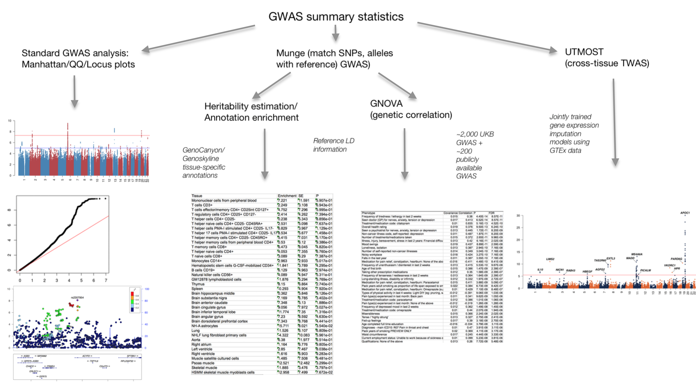

# post-GWAS-pipeline
This repository is a pipeline built for post-GWAS analysis. With GWAS summary statistics as input, the pipeline will generate the following analysis:
* *Manhattan plot/QQ plot/[LocusZoom](http://locuszoom.org/)*
* *[Heritability estimation](https://github.com/bulik/ldsc)/annotation-stratified enrichment analysis*
* *[GNOVA](https://github.com/xtonyjiang/GNOVA) genetic correlation estimation with 2419 UKB traits + 210 published GWAS*
* *[UTMOST](https://github.com/Joker-Jerome/UTMOST) cross-tissue gene-trait association analysis*

## Workflow

## Quick start

### Dependency

### Setup paths

